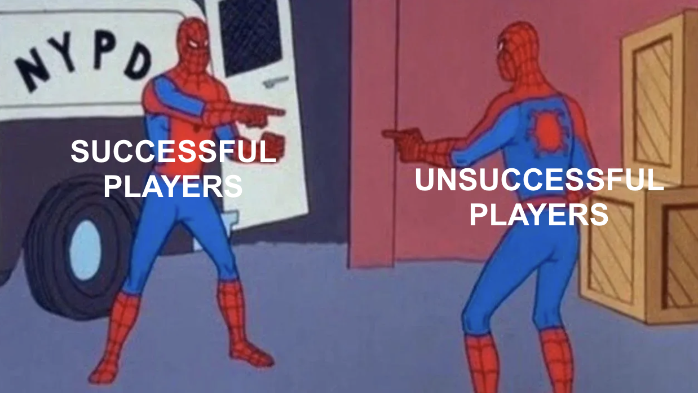

## Intro: The Enigmatic World of Wikispeedia ##

Our minds are complex instruments, constantly composing thoughts, yet we know so little about the notes behind the music. Usually discreet, our brains occasionally let the curtain slip, revealing their inner workings in unexpected settings. 
Enter Wikispeedia: a cognitive revelation hidden in a simple game. Players dart from one Wikipedia article to the next, aiming for a target. As they navigate, they leave behind a trail of thoughts. What secrets do these trails unravel about the voyagers? 
Take a trip with us as we explore these mental pathways.

    

---
## Game Characteristics - Cracking the Wikispeedia Enigma ##

To crack the code of player behavior, we first need to understand the game's properties. 
In Wikispeedia players journey through a maze of Wikipedia articles 4604 articles spanning 129 semantical categories from Geography, History, Technology, you name it !

<iframe src="html_plots/proprtion_per_cat.html" width="100%" height="600"  style="box-shadow: none; border: none;"></iframe>

In an attempt to connect the dots between a source and a target article, players have weaved 405,835 paths :
- 256,585 successful attempts paths where the target was reached
- 149,250 unsuccessful attempts

Since we're trying to leverage the player's behaviour to map their cognitive patterns, we need to take a stop 
and analyze what makes a difference between successful and unsuccessful players. Do successful players simply "know better"
or is there something deeper in the works ?

---

## What's the game plan coach ? ##

The first layer of a player's knowledge is their strategy. Imagine trying to go from point A to B in an unfamiliar town (no GPS allowed of course), how would you proceed? 

You’d likely try to find your way to a central location like the town square, and proceed from there.
Something very similar is observed in the basic strategy that players, whether they finish 
the path or not.

To uncover this strategy we need a measure of the "popularity" of an article.
However, we should take into account the unbalanced nature of our links, the in-link out-link
distribution is different between the two :

<iframe src="html_plots/Incoming_plot_line.html" width="100%" height="600" style="box-shadow: none; border: none;"></iframe>

<iframe src="html_plots/Outgoing_plot_line.html" width="100%" height="600" style="box-shadow: none; border: none;"></iframe>

Therefore simply basing  the degree isn't sufficient.
This is where the PageRank algorithm enters the fray, providing us with a robust measure of an article’s stature within the game.

<!-- pyramids plot -->

    
Path Length: 4 

    <input type="range" min="4" max="20" value="4" id="pathLengthSlider" onchange="updatePlot(this.value)">

    <iframe id="plotFrame" src="html_plots/interactive_pyramids/plot_path_length_4.html" width="100%" height="400" frameborder="0"></iframe>

<!-- ========================= -->

As we suposed, players take a hike, find a good "peak" and try 
to go down as fast as possible to the target, when they fail, they 
repeat the procedure again, until they succed or get too tired of hiking !

Since this strategy is common to both successful and unsuccessful 
players, we need to dig a bit deeper to see if there is a true difference between 
them.

Luckily now that we have the clear distinction between the two phases of the game :
- Up Path : looking for the highest first peak 
- Down Path : going down from the peak to find the target 

We have isolated where player cognition (and connections between categories) come into play :
the risky Down path, here players show off their knowledge and 
navigationnal skills, we define a proximity metric between categories based 
on how often they appear in succession in a path, meaning they 
are not only tightly connected in the structure of the game (since the link between the two is present)
but the player knowingly chose to take them therefore justifying 
their use as a connection index, we can observe the following 
connections : 
- **Heat map of the finished Down Paths:** 
<iframe src="html_plots/heat_maps/heatmap_down_fin.html" width="100%" height="600" style="box-shadow: none; border: none;"></iframe>

- **Heat map of the unfinished Down Paths:** 
<iframe src="html_plots/heat_maps/heatmap_down_unf.html" width="100%" height="600" style="box-shadow: none; border: none;"></iframe>

Aha, the patterns are different ! But wait these plots actually prove 
that unsuccessful players explore more connections that succesful ones, 
hence play success is independant of strategy and knowledge. it is maily related to the game instance.

    

Now we know that all paths contain breadcrumbs to player cognitive connections, 
all that is left now is to follow them : 

---

## Extracting the Juice ##

Let's delve into the learning behaviour of the players. 
In first game plays, players tend to explore various strategies 
without a clear and efficient pattern. 

The idea here is to visualize the evolution of the semantic links through 
a metric we defined depending on the weights of the links between catefories (found in the heatmaps). 
This metric is then used to extract the distances separating the categories to
create a scatter plot that translates the semantic closeness of the categories. 

We take care of removing the outliers keeping only the players that played between 
30 and 250 games.

We compare first plays **Before training**
against last plays **After training** to gain insights on the learning process 
of player, we present here the evolution of 5 of these categories :

<!-- HTML for Dropdown Menu -->
<select id="categorySelect" onchange="updateImage()">
    <option value="1" selected>Astronomy</option>
    <option value="3">Food and Agriculture</option>
    <option value="4">Engineering</option>
    <option value="5">Plants</option>
    <!-- Add more categories as needed -->
</select>

<!-- Image Placeholder -->

<iframe id="categoryImageBefore" src="html_plots/brain_categories_images/categories/before_training_cat1.html" width="100%" height="600" style="box-shadow: none; border: none;"></iframe>
<iframe id="categoryImageAfter" src="html_plots/brain_categories_images/categories/after_training_cat1.html" width="100%" height="600" style="box-shadow: none; border: none;"></iframe>

<!-- JavaScript to Update Image -->

The pre-training plots show a central node surrounded by 
many nearby nodes, indicating a stage of exploration. The proximity of these 
nodes to the central one suggests an initial understanding of the game but without optimizations (tricks and shortcuts).

In contrast, post-training plots illustrate two significant changes : 

- There are **fewer nodes near the center** target, but they are much closer! This shows that players are now focusing on more effective 
strategies that bring them closer to their goals.
- There is an **increased distance** of the other 
nodes from the center reflects a discard of less useful paths. 

Essentialy, when we look at the progress of experienced players,
we can clearly see how they improve from their initial tries to their
more advanced techniques later on. This shows us how their their cognitive map of the game sharpens !

<iframe src="html_plots/network_graph-3.html" width="100%" height="600"></iframe>

---
## The Odyssey of an Exceptional Player ##
But there’s an outlier in our adventure: a player who’s navigated through about 5000 games. What’s the story behind this marathon? This player is like a rare gem in our exploration, offering a unique perspective into the intricate workings of a seasoned Wikispeedia navigator. In our analysis, we use p-values and t-test values to examine a key hypothesis: Does the time taken to find the final destination in a given category vary significantly after the player has played many games? A **smaller p-value** (at the 0.1 threshold) suggests a **significant change in time spent**, on the other hand the t-value indicates the nature of this change: 
- **Negative t-values** mean the player is becoming slower
- **Positive t-values** suggest the player is learning faster, mastering the category quicker 
<iframe src="html_plots/p_values_plot.html" width="100%" height="600" style="box-shadow: none; border: none;"></iframe>
<iframe src="html_plots/t_values_plot.html" width="100%" height="600" style="box-shadow: none; border: none;"></iframe>

In IT and Geography, the **significant p-values and negative t-values**
indicate they are taking more time in these categories. 
This slowing down might be due to a more methodical approach, 
perhaps seeking a decision to **focus on accuracy in complex areas** 

However, for Design & Tech, Religion, and Language & Litterature although
**initially slower**, have shown over time remarkable improvement.  
It’s like unlocking a secret power-up, making leaps in understanding! 

So, our intrepid Wikispeedia player, initially more lost than a tourist without a map in Design & Tech, Religion, and Language & Literature, has turned into a seasoned navigator. It's like they've cracked the code, moving from 'Where am I?' to 'I've got this!' in record time. They've transformed their journey from a meandering stroll through Wikipedia's corridors into a high-speed chase for knowledge, outpacing their past self with the finesse of a trivia maestro. It's a classic tale of the underdog turned unexpected hero in the world of digital exploration.
---

## Conclusion : ##

<!-- category frequency plot -->
<!-- ========================= -->

<!-- CSS for Styling -->

