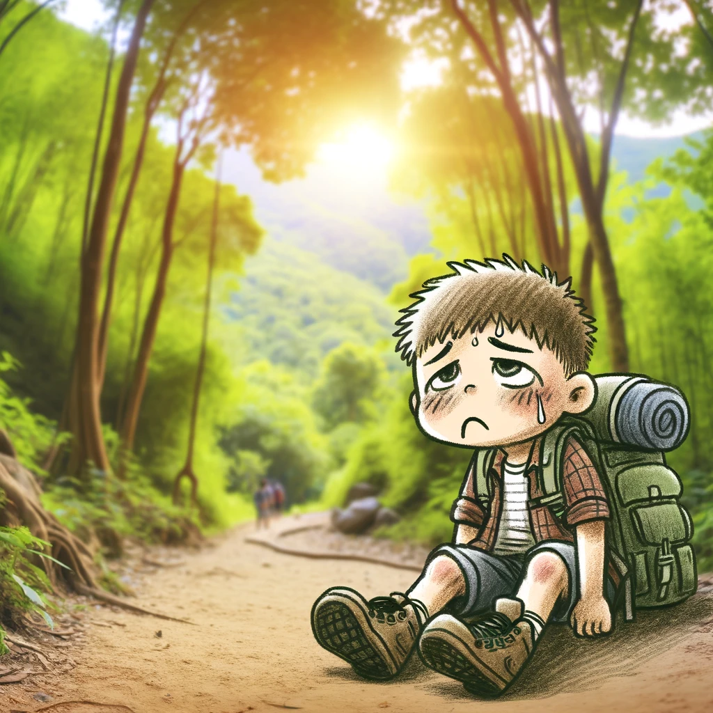

**Intro: The Enigmatic World of Wikispeedia**

Our minds are complex instruments, constantly composing thoughts, yet we know so little about the notes behind the music. Usually discreet, our brains occasionally let the curtain slip, revealing their inner workings in unexpected settings. 
Enter Wikispeedia: a cognitive revelation hidden in a simple game. Players dart from one Wikipedia article to the next, aiming for a target. As they navigate, they leave behind a trail of thoughts. What secrets do these trails unravel about the voyagers? 
Dive in and with us as ew explore these mental pathways.

---
**art 1: Game Characteristics - Cracking the Wikispeedia Enigma**

To crack the code of player behavior, we first need to understand the game's properties. in Wikispeedia players journey through a maze of Wikipedia articles 4604 articles spanning 129 semantical categories from Geography, History, Technology, you name it !

<iframe src="html_plots/category_frequency.html" width="100%" height="600" style="box-shadow: none; border: none;"></iframe>

In an attempt to connect the dots between a source and a target article, players have weaved 405,835 paths :
- 256,585 successful attempts paths where the target was reached
- 149,250 unsuccessful attempts

Since we're trying to leverage the player behaviour to map their cognitive patterns, we need to take a stop 
and analyze what makes a difference between successful and unsuccessful players. Do successful players simply "know better"
or is there something deeper in the works ?

---

**Part 2: What's the game plan coach ?**

The first layer to a player's knowledge is their strategy. Imagine trying to go from point A to B in an unfamiliar town (no GPS allowed of course), how would you procede ? 

You’d likely try to find your way to a central location like the town square, and proceed from there.
Something very similar is observed in the basic strategy that players, whether they finish 
the path or not.

To uncover this strategy we need a measure of "popularity" of a stop (article)
However we should take into account the unbalanced nature of our links, the in link out link
distribution is different between the two :

<iframe src="html_plots/Incoming_plot_line.html" width="100%" height="600" style="box-shadow: none; border: none;"></iframe>

<iframe src="html_plots/Outgoing_plot_line.html" width="100%" height="600" style="box-shadow: none; border: none;"></iframe>

Therefore simply basing  the degree isn't sufficient.
This is where the PageRank algorithm enters the fray, providing us with a robust measure of an article’s stature within the game.

<!-- pyramids plot -->

<input type="range" min="4" max="20" value="4" id="pathLengthSlider" onchange="updatePlot(this.value)">

Path Length: 4

    <iframe id="plotFrame" src="html_plots/interactive_pyramids/plot_path_length_4.html" width="800" height="600" frameborder="0"></iframe>

<!-- ========================= -->

As we suposed, players take a hike, find a good "peak" and try 
to go down as fast as possible to the target, when they fail, they 
repeat the procedure again, until they succed or get too tired of hiking !

Since this strategy is common to both successful and unsuccessful 
players, we need to dig a bit deeper to see if there is a true difference between 
them.

Luckily now that we have the clear distinction between the two phases of the game :
- Up Path : looking for the highest first peak 
- Down Path : going down from the peak tofind the target 

We have isolated where player cognition (and connections between categories) come into play :
the risky Down path, here players show off their knowledge and 
navigationnal skills, we define a proximity metric between categories based 
on how often they appear in succession in a path, meaning they 
are not only tightly connected in the structure of the game (since the link between the two is present)
but the player knowingly chose to take them therefore justifying 
their use as a connection index, we can observe the following 
connections : 
- hmap_down_finished : 
<iframe src="html_plots/heat_maps/hmap_down_finished.html" width="100%" height="600" style="box-shadow: none; border: none;"></iframe>

- hmap_down_unfinished : 
<iframe src="html_plots/heat_maps/hmap_down_unfinished.html" width="100%" height="600" style="box-shadow: none; border: none;"></iframe>

Aha, the patterns are different ! But wait these plots actually prove 
that unsuccessful players explore more connections that succesful ones, 
hence play success is independant of strategy and knowledge. Sometimes the game task
is simply a hard one 

// TO DO, add in degree task ?

Now we know that all paths contain breadcrumbs to player cognitive connections, 
all taht ias left now is to follow them : 

---

**Part 3: Extracting the Juice**

Now that we know where to look and what to look for : – the aggregate paths and proximity metrics – we conjure up a mind map of the major cognitive connections. 

Even more fascinating, by isolating the paths of veteran players, we see a clear evolution from their early attempts to their later, more refined strategies. What emerges is a collective portrait of cognitive growth.

---
**Part 4: The Odyssey of an Exceptional Player**

But there's an outlier in our adventure: a player who's navigated through about 5000 games. What’s the story behind this marathon of the mind? This player is like a rare gem in our exploration, offering a unique perspective into the intricate workings of a seasoned Wikispeedia navigator. Let’s dive into this exceptional journey and see what secrets we can uncover.

---

**Plots**

<!-- pyramids plot -->

<input type="range" min="4" max="20" value="4" id="pathLengthSlider" onchange="updatePlot(this.value)">

Path Length: 4

    <iframe id="plotFrame" src="html_plots/interactive_pyramids/plot_path_length_4.html" width="800" height="600" frameborder="0"></iframe>

<!-- ========================= -->

<iframe src="html_plots/network_graph.html" width="100%" height="600"></iframe>

<!-- degree frequency plot -->

<!-- ========================= -->

<!-- category frequency plot -->

<iframe src="html_plots/category_frequency.html" width="100%" height="600" style="box-shadow: none; border: none;"></iframe>

<!-- ========================= -->
<!-- hmap plots plot -->
<iframe src="html_plots/heat_maps/hmap_up_finished.html" width="100%" height="600" style="box-shadow: none; border: none;"></iframe>

<iframe src="html_plots/heat_maps/hmap_down_finished.html" width="100%" height="600" style="box-shadow: none; border: none;"></iframe>

<iframe src="html_plots/heat_maps/hmap_up_unfinished.html" width="100%" height="600" style="box-shadow: none; border: none;"></iframe>

<iframe src="html_plots/heat_maps/hmap_down_unfinished.html" width="100%" height="600" style="box-shadow: none; border: none;"></iframe>

<!-- ========================= -->

<!-- HTML for Dropdown Menu -->
<select id="categorySelect" onchange="updateImage()">
    <option value="1">Astronomy</option>
    <option value="2">Mammals</option>
    <option value="3">Food and Agriculture</option>
    <option value="4">Engineering</option>
    <option value="5">Plants</option>
    <!-- Add more categories as needed -->
</select>

<!-- Image Placeholder -->

<iframe id="categoryImageBefore" src="html_plots/brain_categories_images/categories/before_training_cat1.html" width="100%" height="600" style="box-shadow: none; border: none;"></iframe>
<iframe id="categoryImageAfter" src="html_plots/brain_categories_images/categories/after_training_cat1.html" width="100%" height="600" style="box-shadow: none; border: none;"></iframe>

<!-- JavaScript to Update Image -->

<!-- CSS for Styling -->

